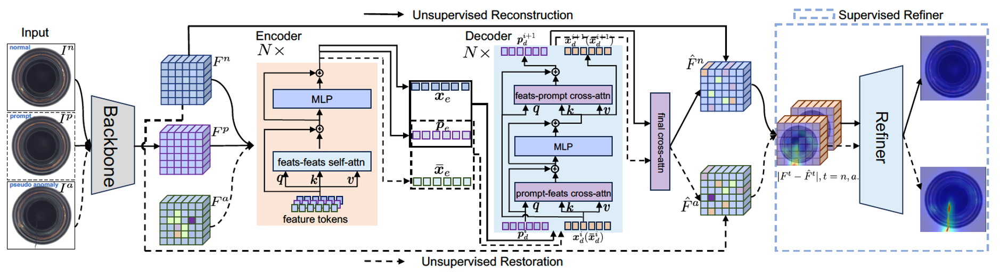
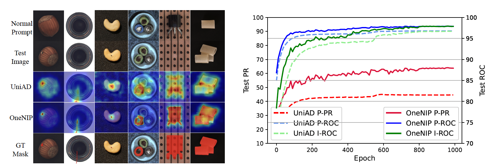

# [ECCV 2024] OneNIP
Official PyTorch Implementation of [Learning to Detect Multi-class Anomalies with Just One Normal Image Prompt](https://csgaobb.github.io/Pub_files/ECCV2024_OneNIP_CR_Full_0725_Mobile.pdf), Accepted by ECCV 2024.



OneNIP mainly consists of Unsupervised Reconstruction, Unsupervised Restoration, and Supervised Refiner. 
Unsupervised Reconstruction and Unsupervised Restoration share the same encoder-decoder architectures and weights. Supervised Refiner is implemented by two transposed convolution blocks, and each following a 1×1 convolution layer.
- Unsupervised Reconstruction reconstructs normal tokens; 
- Unsupervised Restoration restores pseudo anomaly tokens to the corresponding normal tokens;
- Supervised Refiner refines reconstruction/restoration errors to achieve more accurate anomaly segmentation.

## 1. Comparsions of OneNIP and UniAD



## 2. Results and checkpoints-v2. 
All pre-trained model weights are stored in Google Drive.

| Dataset |  Input-Reslution | I-AUROC | P-AUROC | P-AUAP | checkpoints-v2 | Test-Log|
| ------ | ------ | ------ | ------ | ------ | ------ | ------ | 
| MVTec |  224 $\times$ 224  |  98.0  |  97.9  |  63.9  |  [model weight](https://drive.google.com/file/d/1fDptxxFy2j2xFi6c23BqGbTh8tBy4cWJ/view?usp=sharing) | [testlog](./checkpoints-v2/onenip-mvtec-4-4-224/log/dec_20241125_200801.log)  | 
| MVTec |  256 $\times$ 256  |  97.9  |  97.9  |  64.8  |  [model weight](https://drive.google.com/file/d/1Yt62r23LbsZlb4JrITZqoQtiKdF6M8ek/view?usp=sharing) | [testlog](./checkpoints-v2/onenip-mvtec-4-4-256/log/dec_20241125_201022.log)  | 
| MVTec |  320 $\times$ 320  |  98.4  |  98.0  |  66.7  |  [model weight](https://drive.google.com/file/d/1jRXWfLxPqsW4Mb0ClH2L6HREUtE8wh4l/view?usp=sharing) | [testlog](./checkpoints-v2/onenip-mvtec-4-4-320/log/dec_20241125_201314.log)  | 
||
| VisA  |  224 $\times$ 224  |  92.8  |  98.7  |  42.5  |  [model weight](https://drive.google.com/file/d/1bq-9ICQ9E7A6etqLm9wBn27wgAjXq4br/view?usp=sharing) | [testlog](./checkpoints-v2/onenip-visa-4-4-224/log/dec_20241125_201721.log)  | 
| VisA  |  256 $\times$ 256  |  93.4  |  98.9  |  44.9  |  [model weight](https://drive.google.com/file/d/1aXcmfk8NlCtVGnk1ZvheCI0XK9aRvGgG/view?usp=sharing) | [testlog](./checkpoints-v2/onenip-visa-4-4-256/log/dec_20241125_202012.log)  |
| VisA  |  320 $\times$ 320  |  94.8 |  98.9  |  46.1  |  [model weight](https://drive.google.com/file/d/1uSl0Df9YUsRYoM9WClypdOL3rlTzHwDd/view?usp=sharing) | [testlog](./checkpoints-v2/onenip-visa-4-4-320/log/dec_20241125_202339.log)  | 
||
| BTAD  |  224 $\times$ 224  |  93.2  |  97.4  |  56.3  |  [model weight](https://drive.google.com/file/d/1kLBrIK3njC2GQv_mLFQdbHpfabWxoTxU/view?usp=sharing) | [testlog](./checkpoints-v2/onenip-btad-4-4-224/log/dec_20241125_202853.log)  | 
| BTAD  |  256 $\times$ 256  |  95.2  |  97.6  |  57.7  |  [model weight](https://drive.google.com/file/d/1R_LoLyhfLqgcmAbjxuggRRs-GIaZLSmt/view?usp=sharing) | [testlog](./checkpoints-v2/onenip-btad-4-4-256/log/dec_20241125_203023.log)  | 
| BTAD  |  320 $\times$ 320  |  96.0  |  97.8  |  58.6  |  [model weight](https://drive.google.com/file/d/1BJ_DNgmy5i4hrHdQWoIGtlDFPKRwJzkx/view?usp=sharing) | [testlog](./checkpoints-v2/onenip-btad-4-4-320/log/dec_20241125_203154.log)  |
|| 
|MVTec+VisA+BTAD| 224 $\times$ 224 |  94.6  |  98.0  |  53.5  |   [model weight](https://drive.google.com/file/d/1Hnc3XshNWgnLyhwmDx6jW0XQzLb7sFEN/view?usp=sharing) | [testlog](./checkpoints-v2/onenip-mvtec+btad+visa-4-4-224/log/dec_20241125_203356.log)  | 
||
|MVTec+VisA+BTAD| 256 $\times$ 256 |  94.9  |  98.0  |  53.1  |   [model weight](https://drive.google.com/file/d/1rGvzxH4gx7gzZptehMvZDeQb7x36h28Y/view?usp=sharing) | [testlog](./checkpoints-v2/onenip-mvtec+btad+visa-4-4-256/log/dec_20241125_204119.log)  | 
||
|MVTec+VisA+BTAD| 320 $\times$ 320 |  95.6  |  97.9  |  54.1  |   [model weight](https://drive.google.com/file/d/1CgVsMidjy7BafUPKMQlEbX0aAb3-itkk/view?usp=sharing) | [testlog](./checkpoints-v2/onenip-mvtec+btad+visa-4-4-320/log/dec_20241125_204829.log)  | 
||


<!--
| Dataset |  Input-Reslution | I-AUROC | P-AUROC | P-AUAP | checkpoints-v2 | Test-Log|
| ------ | ------ | ------ | ------ | ------ | ------ | ------ | 
| MVTec |  224 $\times$ 224  |  97.9  |  97.9  |  63.7  |  [model weight](https://drive.google.com/file/d/1q6gMbBKrF-sM1822KlFhmj-jCbMEdBMa/view?usp=sharing) | [testlog](./checkpoints-v2/onenip-mvtec-4-4-224/log/dec_20240921_215951.log)  | 
| MVTec |  256 $\times$ 256  |  97.6  |  97.9  |  64.8  |  [model weight](https://drive.google.com/file/d/1eVXrncc7iRtaNQpyHk3cQ1QQlPBhXpuF/view?usp=sharing) | [testlog](./checkpoints-v2/onenip-mvtec-4-4-256/log/dec_20240921_220207.log)  | 
| MVTec |  320 $\times$ 320  |  97.9  |  97.9  |  65.9  |  [model weight](https://drive.google.com/file/d/19xK8nksu1uBG-Affbcu6cZmaj10cMeSL/view?usp=sharing) | [testlog](./checkpoints-v2/onenip-mvtec-4-4-320/log/dec_20240921_220430.log)  | 
||
| VisA  |  224 $\times$ 224  |  92.5  |  98.7  |  43.3  |  [model weight](https://drive.google.com/file/d/16r5pq5CBVPgu2jMizVJW83K0oB_xdmFl/view?usp=sharing) | [testlog](./checkpoints-v2/onenip-visa-4-4-224/log/dec_20240921_221901.log)  | 
| VisA  |  256 $\times$ 256  |  93.1  |  98.8  |  44.9  |  [model weight](https://drive.google.com/file/d/1ZV2Hh5oniMW1cePsRQ_RPgkCBIOQHoIi/view?usp=sharing) | [testlog](./checkpoints-v2/onenip-visa-4-4-256/log/dec_20240921_225047.log)  |
| VisA  |  320 $\times$ 320  |  94.2  |  98.8  |  46.1  |  [model weight](https://drive.google.com/file/d/17DX4ukJIzMAKYfLPMu1yp3VbvFfXNCvo/view?usp=sharing) | [testlog](./checkpoints-v2/onenip-visa-4-4-320/log/dec_20240921_220825.log)  | 
||
| BTAD  |  224 $\times$ 224  |  92.6  |  97.4  |  56.8  |  [model weight](https://drive.google.com/file/d/1drMQZubI3dFz0yNXJuyTOU4DmmFkGNEc/view?usp=sharing) | [testlog](./checkpoints-v2/onenip-btad-4-4-224/log/dec_20240921_221227.log)  | 
| BTAD  |  256 $\times$ 256  |  94.6  |  97.6  |  57.0  |  [model weight](https://drive.google.com/file/d/1avzuJQLd2Xd_7hUEG25s1ev7cMqNUNJz/view?usp=sharing) | [testlog](./checkpoints-v2/onenip-btad-4-4-256/log/dec_20240921_221334.log)  | 
| BTAD  |  320 $\times$ 320  |  95.3  |  97.8  |  57.6  |  [model weight](https://drive.google.com/file/d/1jRyIrwR96tAgjvdvLJ8346Hylugr0rmu/view?usp=sharing) | [testlog](./checkpoints-v2/onenip-btad-4-4-320/log/dec_20240921_235736.log)  |
|| 
|MVTec+VisA+BTAD| 224 $\times$ 224 |  94.5  |  98.0  |  52.4  |   [model weight](https://drive.google.com/file/d/17sccEGFcFYFOwDp6e3Mh0a5QK8iOUeFT/view?usp=sharing) | [testlog](./checkpoints-v2/onenip-mvtec+btad+visa-4-4-224/log/dec_20240921_230615.log)  | 
||
-->

## 3. Evaluation and Training

### 3.1 Prepare data
Download [MVTec](https://www.mvtec.com/company/research/datasets/mvtec-ad), [BTAD](https://avires.dimi.uniud.it/papers/btad/btad.zip), [VisA](https://amazon-visual-anomaly.s3.us-west-2.amazonaws.com/VisA_20220922.tar) and [DTD](https://www.robots.ox.ac.uk/~vgg/data/dtd/download/dtd-r1.0.1.tar.gz) datasets. Unzip and move them to `./data`. The data directory should be as follows.
```
├── data
│   ├── btad
│   │   ├── 01
│   │   ├── 02
│   │   ├── 03
│   │   ├── test.json
│   │   ├── train.json
│   ├── dtd
│   │   ├── images
│   │   ├── imdb
│   │   ├── labels
│   ├── mvtec
│   │   ├── bottle
│   │   ├── cable
│   │   ├── ...
│   │   └── zipper
│   │   ├── test.json
│   │   ├── train.json
│   ├── mvtec+btad+visa
│   │   ├── 01
│   │   ├── bottle
│   │   ├── ...
│   │   └── zipper
│   │   ├── test.json
│   │   ├── train.json
│   ├── visa
│   │   ├── candle
│   │   ├── capsules
│   │   ├── ...
│   │   ├── pipe_fryum
│   │   ├── test.json
│   │   ├── train.json
```


### 3.2 Evaluation with pre-trained checkpoints-v2
Download pre-trained checkpoints-v2 to `./checkpoints-v2`
```
cd ./exps
bash eval_onenip.sh 8 0,1,2,3,4,5,6,7
```


### 3.3 Training OneNIP

```
cd ./exps
bash train_onenip.sh 8 0,1,2,3,4,5,6,7
```

## Citing

If you find this code useful in your research, please consider citing us:
```
@inproceedings{gao2024onenip,
  title={Learning to Detect Multi-class Anomalies with Just One Normal Image Prompt},
  author={Gao, Bin-Bin},
  booktitle={18th European Conference on Computer Vision (ECCV 2024)},
  pages={-},
  year={2024}
}
```


## Acknowledgement

Our OneNIP is built on [UniAD](https://github.com/zhiyuanyou/UniAD). Thank the authors of UniAD for open-sourcing their implementation codes!


## Star History

[](https://www.star-history.com/#gaobb/OneNIP&Date)
